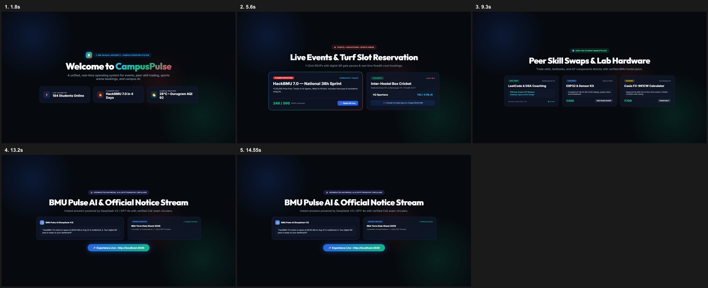
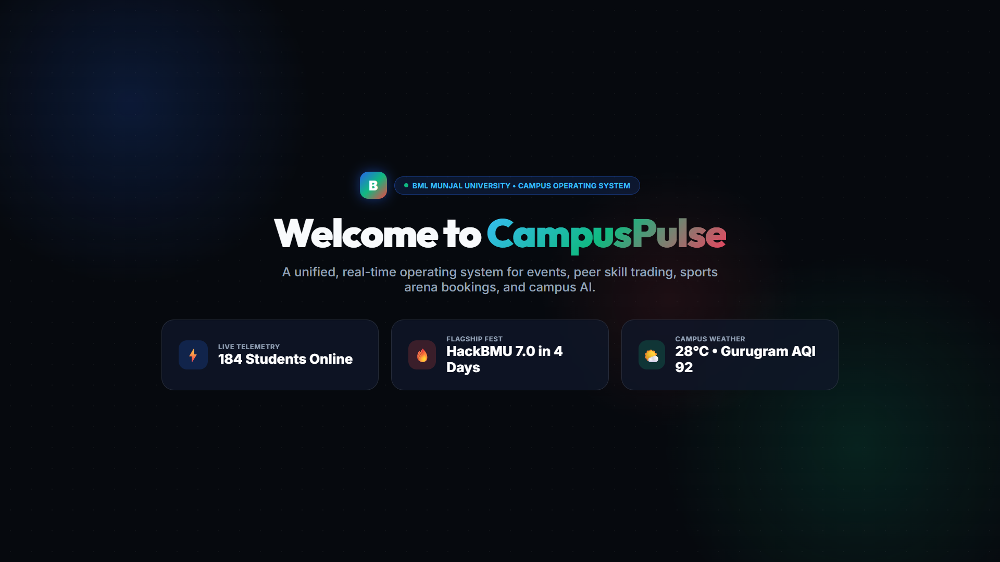
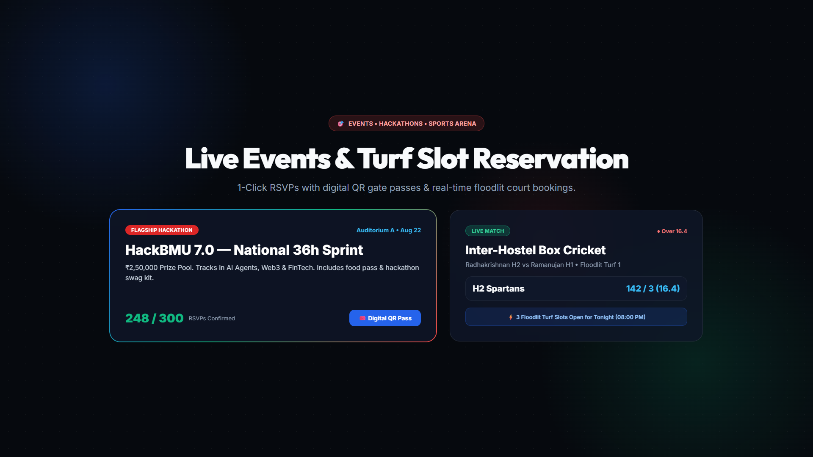
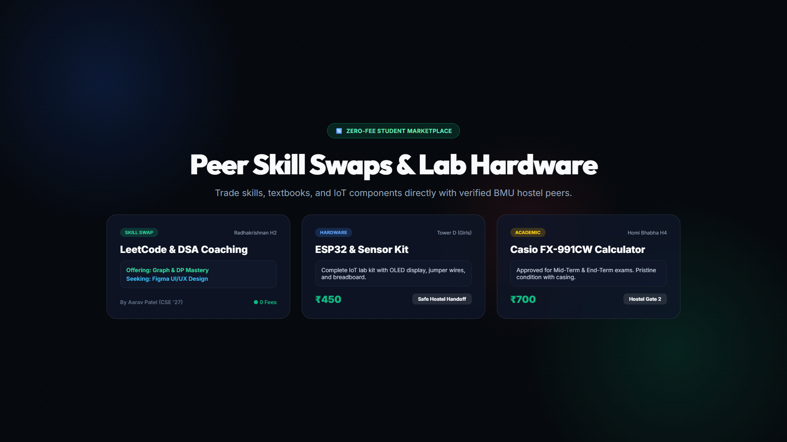
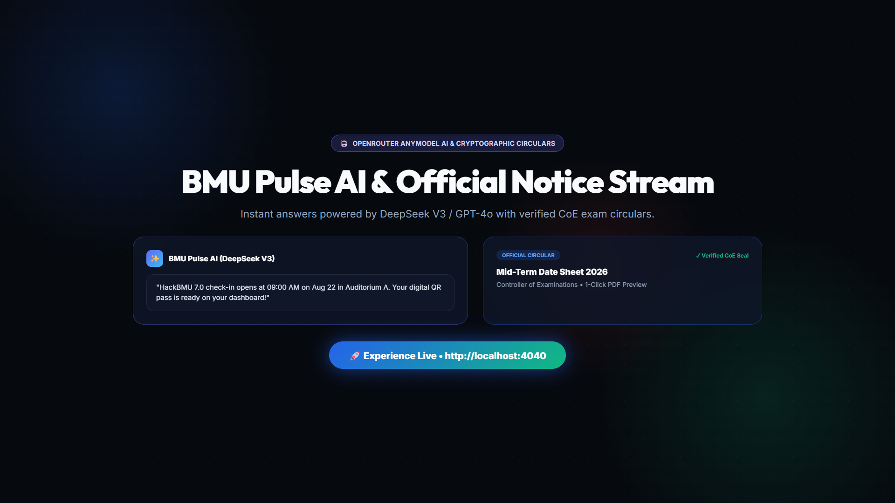

# BMU_Community • CampusPulse OS

> **A Unified Real-Time Campus Operating System & Community Hub for BML Munjal University (BMU)**  
> *Consolidating Student Events & Hackathons, Peer Skill/Hardware Trade, Sports Arena Court Bookings, Verified Academic Circulars, Safety SOS, and OpenRouter AnyModel AI Assistant into One Live Telemetry Grid.*

[](https://github.com/ojaspurwar/BMU_Community)
[](https://openrouter.ai/)
[](https://calendar.google.com/)
[](https://react.dev/)
[](https://www.typescriptlang.org/)
[](https://tailwindcss.com/)
[](LICENSE)

---

## 🎥 Platform Showcase Video & Live Walkthrough

<div align="center">

<!-- GitHub HTML5 Embedded Video Player -->
<video src="videos/bmu-showcase/out.mp4" poster="videos/bmu-showcase/snapshots/frame-00-at-1.8s.png" width="100%" controls autoplay loop muted playsinline>
  Your browser does not support the video tag. <a href="videos/bmu-showcase/out.mp4">Click here to view the showcase video</a>.
</video>

<br />

<a href="videos/bmu-showcase/out.mp4" target="_blank">
  
</a>

<br />

**[▶️ Click to Watch Full 60s HD Video Showcase (out.mp4)](videos/bmu-showcase/out.mp4)** &nbsp;•&nbsp; **[📸 Browse High-Res Frame Snapshots](videos/bmu-showcase/snapshots/)** &nbsp;•&nbsp; **[🎬 Interactive Showcase Deck](videos/bmu-showcase/index.html)**

</div>

### 📸 Video Frame Highlights

| 🏠 1. Live Telemetry & Weather | ⚡ 2. Events & Court Bookings |
| :---: | :---: |
|  |  |
| **Real-time online students, weather & AQI** | **HackBMU 7.0 RSVPs & Turf slot reservations** |

| 🤝 3. Peer Skill & Hardware Trade | 🤖 4. BMU Pulse AI & CoE Circulars |
| :---: | :---: |
|  |  |
| **0-fee hardware swaps & DSA mentoring** | **OpenRouter AnyModel AI & Verified Circulars** |

---

## 🧪 Test Run / Prototype Environment Notice

> [!NOTE]
> **This repository is configured in Test Run / Demo Mode for project submission and evaluation.**
> - **Pre-Populated Mock Data:** Realistically seeded with BMU campus data (HackBMU 7.0 with ₹3L prize pool, Hostel Premier League matches, SOET hardware swaps, court bookings, and verified CoE circulars).
> - **Multi-Student Personas:** Switch between verified accounts (*Aarav Patel, Ishaan Verma, Kabir Mehta, Tanvi Agarwal*) or create custom student identities with the live holographic ID generator.
> - **OpenRouter AnyModel AI Assistant:** Integrated with DeepSeek V3, GPT-4o Mini, Llama 3.3 70B, Claude 3.5 Sonnet, or custom OpenRouter model slugs.
> - **1-Click Google Calendar Sync:** Add events, sports arena slots, circular deadlines, and custom agenda items directly to Google Calendar.
> - **Real-Time Multi-Tab Synchronization:** Open two browser tabs side-by-side to witness real-time cross-tab sync (RSVPs, court bookings, marketplace saves, match cheering, SOS alerts).

---

## 🌟 Executive Overview & Purpose

At **BML Munjal University (BMU)**, student life is dynamic but often fragmented across dozens of disconnected WhatsApp groups, lost email circulars, unstructured spreadsheets, and manual bulletin boards.

**BMU_Community (CampusPulse OS)** solves this by unifying four core campus pillars into a single, high-performance, cyber-aesthetic real-time web platform:

```
                   ┌──────────────────────────────────────────┐
                   │         CampusPulse BMU Platform         │
                   │        (Live Telemetry & Sync OS)        │
                   └────────────────────┬─────────────────────┘
                                        │
         ┌──────────────────────────────┼──────────────────────────────┐
         ▼                              ▼                              ▼
┌──────────────────┐          ┌───────────────────┐          ┌───────────────────┐
│ 1. Events & Fest │          │ 2. Peer Skill &   │          │ 3. Sports & Arena │
│   Radar + QR Pass│          │    Gear Swap Hub  │          │    Court Booking  │
└──────────────────┘          └───────────────────┘          └───────────────────┘
         │                              │                              │
         └──────────────────────────────┼──────────────────────────────┘
                                        │
                                        ▼
                           ┌─────────────────────────┐
                           │ 4. Verified Circulars   │
                           │   (CoE, CDC, DSW Feeds) │
                           └────────────┬────────────┘
                                        │
                                        ▼
                           ┌─────────────────────────┐
                           │ 5. BMU Pulse AI         │
                           │ (OpenRouter AnyModel)   │
                           └─────────────────────────┘
```

---

## 🛠️ Technologies Used

| Category | Technology / Library | Description & Purpose |
|---|---|---|
| **Core Framework** | **React 19.0** | Modern component architecture, hooks, and responsive rendering |
| **Language** | **TypeScript 5.7** | Strict type contracts across all models, data entities, and context actions |
| **Styling Engine** | **Tailwind CSS 3.4** | Custom BMU Cyber-Tricolor design system, utility tokens, and animations |
| **CSS Processors** | **PostCSS & Autoprefixer** | Cross-browser compatibility and optimized production stylesheets |
| **AI Intelligence** | **OpenRouter API (AnyModel)** | Multi-LLM inference engine (DeepSeek V3, GPT-4o Mini, Llama 3.3 70B, Claude 3.5 Sonnet, custom slugs) |
| **Icons** | **Lucide React (v0.475.0)** | Consistent, pixel-perfect iconography across all modules and navigation |
| **Visual Effects** | **Canvas-Confetti (v1.9.4)** | Celebratory micro-animations for RSVPs, court bookings, and profile updates |
| **State Management** | **React Context API** | Unified centralized state provider (`useCampusPulse`) for global application data |
| **Multi-Tab Sync** | **BroadcastChannel API** | Real-time cross-tab synchronization (`campuspulse_bmu_sync`) with `localStorage` persistence |
| **Development Server** | **Custom Node.js Server (`server.cjs`)** | Zero-bundle server with on-the-fly Sucrase TSX transpilation & `/api/ai/chat` proxy route |
| **Audio Engine** | **HTML5 Web Audio API** | Focus soundscape generator with volume mixer and animated equalizer waveforms |

---

## 🎨 Design System & Theme: Cyber-Tricolor

- **Deep Void Slate Surfaces (`#06090e`, `#0d131f`)**: Ultra-dark frosted glass containers with `backdrop-blur-2xl` and subtle slate borders.
- **Crimson / Ruby Red (`#ef4444`, `#dc2626`)**: Powering Events & Fests, HackBMU 7.0 countdown tickers, urgent priority notices, and Emergency SOS beacons.
- **Emerald / Mint Green (`#10b981`, `#059669`)**: Powering the Peer Marketplace, zero-fee skill trades, safe meeting spots, and live active indicators.
- **Sapphire / Electric Cyan Blue (`#2563eb`, `#38bdf8`)**: Powering main telemetry grids, verified academic badges, student ID cards, and official circulars.
- **Fluid Layout**: Expansive fullscreen desktop container (`max-w-[1700px]`) and thumb-friendly mobile bottom navigation bar (`lg:hidden`).

---

## 🚀 Detailed Features & Capabilities

### 1. 🤖 BMU Pulse AI (OpenRouter AnyModel Engine)
- **Multi-LLM Model Selector:** Switch on-the-fly between:
  - ⚡ **DeepSeek V3** (`deepseek/deepseek-chat` - Ultra Fast & Technical)
  - 🚀 **OpenAI GPT-4o Mini** (`openai/gpt-4o-mini` - Precision & Coding)
  - 🦙 **Meta Llama 3.3 70B** (`meta-llama/llama-3.3-70b-instruct` - Open-Weight Powerhouse)
  - 🔮 **Claude 3.5 Sonnet** (`anthropic/claude-3.5-sonnet` - Nuanced Writing)
  - 🌟 **Google Gemini Flash 1.5** (`google/gemini-flash-1.5`)
  - 🧪 **Custom AnyModel Slug** (enter any of OpenRouter's 300+ models!)
- **Live Campus Context Injection:** Automatically injects BMU live telemetry, HackBMU 7.0 schedules, sports facility availability, peer marketplace items, and CoE circulars into system instructions.
- **Interactive Chat Interface:** Markdown formatting, code syntax blocks, 1-click copy response, and conversation history controls.
- **Floating Quick AI Action Button:** 1-click access from anywhere on the screen with real-time thinking status.

### 2. 🎟️ Events, Fests & HackBMU 7.0 Hub (Crimson Red Pillar)
- **Live HackBMU 7.0 Countdown Ticker:** Real-time countdown tracking days, hours, minutes, and seconds to BMU's flagship ₹3L hackathon.
- **Category Filtering:** Filter campus happenings by *Coding*, *Cultural*, *Sports*, *Workshops*, *Academic*, and *Fest*.
- **1-Click RSVP System:** Instant RSVP confirmation with synchronized attendee counters across all browser tabs and celebratory confetti.
- **Digital Holographic QR Entry Pass Modal:** Generates an official verified gate entry pass with roll number, seat tier, and print/save capability for auditorium and turnstile access.
- **`.ics` Calendar File Export:** 1-click download of `.ics` calendar files compatible with Apple Calendar, Google Calendar, and Outlook.
- **Event Proposal Modal:** Dedicated form for student councils and clubs (ACM, IEEE, Culrav, Enactus) to propose campus events.

### 3. 🔄 Peer Skill & Dorm Gear Marketplace (Emerald Green Pillar)
- **Zero-Commission Student Economy:** Buy, sell, borrow, or swap textbooks, dorm electronics, scientific calculators, and hardware kits.
- **Interactive Peer Skill Matchmaker Engine:** Intelligent skill trade matching connecting skills offered (*React, LeetCode, UI/UX*) with skills requested (*Calculus, Embedded C, Python*).
- **In-App Negotiation Chat Drawer:** Simulated real-time buyer-seller chat with instant auto-replies, suggested quick prompts, and deal status updates (*Available / Reserved / Completed*).
- **Campus Safe Trade Zones:** Highlights verified public exchange points (*SAC Lounge, Central Library Ground Floor, Gate 1 Security*).

### 4. 🏆 Sports & Athletics Arena Grid (Amber & Crimson Pillar)
- **Interactive Court & Arena Slot Booking:** Real-time slot booking for:
  - *BMU Indoor Badminton Complex (Courts 1–3)*
  - *Main Floodlit Football Turf & Athletics Arena*
  - *All-Weather Basketball Complex (Courts 1 & 2)*
  - *BMU Fitness Hub & Strength Gym*
  - *Lawn Tennis Arena (Courts A & B)*
  - *Cricket Practice Pavilion & Astroturf Nets*
- **Live Headcount & Equipment Inventory:** Live occupancy capacity bars and equipment lending desk inventory (*Yonex rackets, Nike match balls, protection gear*).
- **Inter-Hostel Premier League (HPL) & Sangram Scoreboard:** Live scores and commentary with interactive **Team Cheer / Fan Counters** (*Cheer Hostel 3 / Cheer Hostel 4*).
- **Squad Finder & Match Challenger Board:** Post and join spontaneous pickup matches (*e.g., "Need 3 players for 8v8 turf match tonight"*) with 1-tap squad joining.

### 5. 📢 Verified University Circulars & Deadlines Stream (Cyber Tricolor Pillar)
- **Official Authenticated Circulars:** Circular stream from Controller of Examinations (CoE), Career Development Centre (CDC Placement), and Dean of Student Welfare (DSW).
- **Color-Coded Priority Levels:** *🚨 Urgent*, *⚠️ Important*, and *📋 Standard* priority tags.
- **Target Batch Filtering:** Instant filtering for B.Tech, MBA, Law, and School of Management.
- **Downloadable Circular PDF Simulation:** Preview and download official authenticated guidelines directly from the modal.
- **Unread Tracking & 1-Click Acknowledgement:** Track unread circular counts and record student reading acknowledgements in real time.

### 6. 👤 Digital Student ID Card & Profile Creator
- **Live Holographic ID Card Preview:** Displays student name, roll number, department badge, residence hostel room, reputation score, and verified BMU chip hologram.
- **Avatar Preset Selector & Custom URL:** Choose from 6 stylish presets or provide any custom image URL.
- **Comprehensive Profile Customizer:** Configure roll number, school/department, graduation cohort, hostel room, bio/tagline, and telegram/contact handle.
- **Skills Tag Cloud:** Interactive tag manager to add and remove skills you can teach or trade.
- **Multi-Persona Profile Switcher:** Switch between verified demo personas (*Aarav Patel, Ishaan Verma, Kabir Mehta, Tanvi Agarwal*) or create custom student identities.

### 7. 🛡️ Campus Safety & Utility Tools
- **24/7 SOS Helpline & Broadcast Beacon:** Instant quick-dial triggers for Campus Ambulance, Gate 1 & 2 Security, Chief Warden, and Mental Health Wellness. Includes an emergency SOS broadcast beacon that synchronizes across all active student screens.
- **Focus Audio Ambience Soundscape Player:** Integrated navbar audio generator with 4 ambient tracks (*Midnight Lo-Fi Beats*, *Aravalli Monsoon Rain*, *Library Whispers*, *SAC Coffee Lounge*), equalizer wave animations, and volume control.
- **Live Weather & AQI Telemetry:** Real-time temperature ($28^\circ\text{C}$), weather conditions, and air quality index for the Sidhrawali campus.
- **Global Search Engine (⌘K):** Instant multi-entity fuzzy search across events, marketplace listings, sports courts/matches, and circulars.
- **Mobile Bottom Navigation & Hamburger Menu:** Clean 4-tab mobile bottom bar and responsive slide-out command center.

---

## 👥 Preloaded Demo Student Profiles

| Student Name | Roll Number | Department | Hostel | Specialization / Role |
|---|---|---|---|---|
| **Aarav Patel** | `230101089` | Computer Science & Engineering | Hostel 3 (Room 214) | Fullstack Dev & HackBMU Organizer |
| **Ishaan Verma** | `230101045` | Electronics & Communication | Hostel 3 (Room 108) | Embedded Systems & IoT Lead |
| **Kabir Mehta** | `220101112` | School of Management (MBA) | Hostel 4 (Room 302) | Enactus & FinTech Specialist |
| **Tanvi Agarwal** | `240101012` | School of Law (BA LLB) | Hostel 2 (Room 415) | Debating Society & Legal Aid |

---

## 🚦 Getting Started Locally

### Prerequisites
- [Node.js](https://nodejs.org/) (v18.0.0 or higher recommended)
- `npm` (bundled with Node.js)

### Installation & Execution

```bash
# 1. Clone the repository
git clone https://github.com/ojaspurwar/BMU_Community.git

# 2. Navigate to the project directory
cd BMU_Community

# 3. Install dependencies
npm install

# 4. Build Tailwind CSS (optional, auto-compiled by server)
npm run build

# 5. Launch the development server
npm run dev
```

The application will be live at:
👉 **`http://localhost:4040`**

### Testing Real-Time Multi-Tab Synchronization
1. Open `http://localhost:4040` in **Tab A**.
2. Open `http://localhost:4040` in **Tab B** (or an incognito window).
3. RSVP to an event, book a court slot, cheer for a sports team, or ask BMU Pulse AI a question — observe real-time synchronization across windows!

---

## 📂 Project Directory Structure

```
BMU_Community/
├── index.html                   # HTML entry shell with Cyber-Tricolor favicon & brand loader
├── package.json                 # Dependencies, scripts & project metadata
├── server.cjs                   # Fast development server with /api/ai/chat proxy route & Sucrase
├── build-app.cjs                # PostCSS + Tailwind CSS compilation script
├── tailwind.config.cjs          # Custom BMU Cyber-Tricolor palette tokens
├── tsconfig.json                # TypeScript configuration
├── README.md                    # Comprehensive documentation & video showcase guide
├── MVD.md                       # Master blueprint & backup document
├── videos/                      # Platform showcase assets & video renders
│   └── bmu-showcase/
│       ├── out.mp4              # 60-second 1080p full platform video showcase
│       ├── index.html           # Interactive GSAP HTML5 showcase deck
│       └── snapshots/           # High-resolution keyframe snapshots & contact sheet
├── public/                      # Static assets & compiled CSS
│   └── globals.css
└── src/
    ├── app/
    │   ├── globals.css          # CSS custom variables, glow utilities & animations
    │   ├── layout.tsx           # Base layout wrapper
    │   └── page.tsx             # Main dashboard with telemetry header, Today tab & 4-pillar grid
    ├── components/
    │   ├── Navbar.tsx           # Fullscreen navbar with Today tab, Ask AI, audio player & profile menu
    │   ├── AIAssistantModal.tsx # OpenRouter AnyModel AI assistant with model selector & context
    │   ├── MyScheduleModal.tsx  # Personal schedule list with 1-click Google Calendar sync
    │   ├── EventModule.tsx      # HackBMU countdown, category filters, RSVP & ticket pass
    │   ├── EventPassModal.tsx   # Verified holographic QR gate pass modal with Google Calendar
    │   ├── MarketplaceModule.tsx# Peer goods, skill trade matchmaker & safe markers
    │   ├── MarketplaceChatDrawer.tsx # In-app negotiation chat drawer
    │   ├── SportsModule.tsx     # Court booking, live HPL match scoreboard & squad challenges
    │   ├── NoticeStreamModule.tsx # Verified circular stream, batch filters & PDF viewer
    │   ├── NoticeDetailModal.tsx# Official circular detail viewer with Google Calendar deadline sync
    │   ├── ProfileModal.tsx     # Custom student ID card creator & skill tags editor
    │   ├── EmergencyQuickDial.tsx # 24/7 SOS helpline modal & campus broadcast beacon
    │   └── GlobalSearchModal.tsx# ⌘K instant search engine
    ├── data/
    │   └── mockData.ts          # Seed data for BMU events, marketplace, sports & notices
    ├── lib/
    │   ├── store.tsx            # Global state provider with OpenRouter AI engine & sync
    │   └── utils.ts             # Google Calendar generator, date formatters, ICS generator & helpers
    └── types/
        └── index.ts             # TypeScript type definitions
```

---

## 📄 License

This project is licensed under the **MIT License** — see the [LICENSE](LICENSE) file for details.

Developed with ❤️ for the **BML Munjal University** student community.
